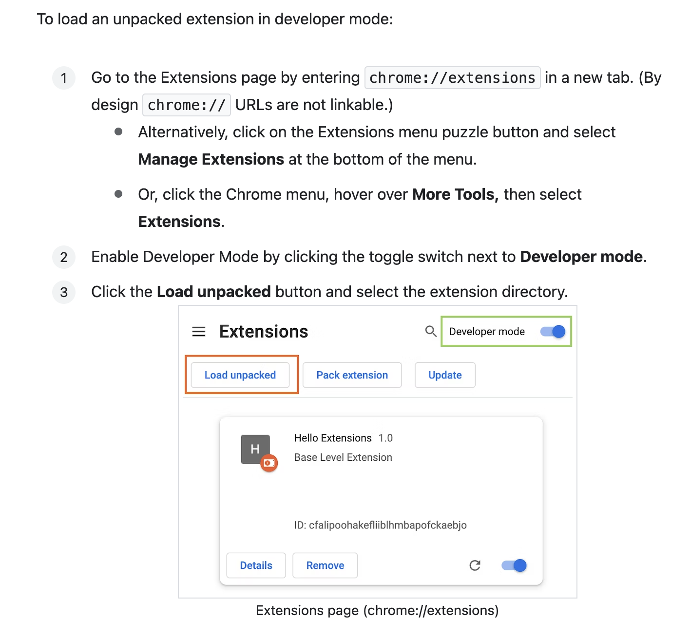

# Purrductivity

Tired of installing so many different browser extensions, or perhaps not even knowing which extensions to install? Purrductivity is a Chrome extension designed to enhance the work experience and provide practical benefits for employees. The primary concept revolves around an interactive Pet character that jumps around the browser. The Pet is accompanied by a chatbot powered by ChatGPT that allows users to ask questions and engage in conversations. In addition to the interactive elements, the extension incorporates productivity features such as a time tracker, reading time estimates, and a focus mode for viewing certain web pages. These features help users manage their time effectively and maintain focus during work sessions. By combining enjoyment, practicality, and productivity, the extension aims to create a more enjoyable and fulfilling work environment for employees.

 
The pet mascot will change on refreshes! Refresh the page to meet trump for a good laugh during your work!

## Inspiration
Google Colab's [Kitty mode](https://twitter.com/i/status/1148286772863856642) 😍

## How To Set Up

- Documentation to run the code locally from Google [here](https://developer.chrome.com/docs/extensions/mv3/getstarted/development-basics/#load-unpacked)

- Use `Ctrl/CMD + B` to open the extension popup

## Features

### 1. Reading Time Estimator
Estimates the reading time for certain webpages ([Medium](https://medium.com/), [Channel NewsAsia](https://www.channelnewsasia.com/), [NUSNews](https://news.nus.edu.sg/))

### 2. Time Tracker
Tracks time spent on different pages: `Ctrl/CMD + B > Click "View Time Traker"`

### 3. Focus Mode
Hides miscellaneous or distracting elements on certain webpages [Medium](https://medium.com/), [Straits Times](https://www.straitstimes.com/), [NUSNews](https://news.nus.edu.sg/): `Alt/Option + Shift + 1`

### 4. Duplicate Tabs
Duplicates the current active tab: `Alt/Option + Shift + 2`

## How we built it
Javascript, HTML, CSS

## Challenges
- Working with different CSS animations
- Integrating multiple features into one extension
- Integrating Chat GPT API and UI into the extension
- Working across different timezones

## Accomplishments
- Started learning how to build a chrome extension and completed a final product in a day 
- Integrated a number of useful functionalities
- Integrated keyboard shortcuts

## Takeaways
- Better understanding of how Chrome extensions are built and how to debug them
- Better understanding of CSS styles and animations
- Testing is important especially when integrating many different features as there may be regression bugs
- Clear and proper delegation of tasks is important to improve efficiency of development

## What's Next?
- Provide more options for pets 
- Allow customizable keyboard shortcuts
- Integrate Chat GPT API and UI
- Support more webpages with Reading Time Estimator and Focus Mode
- Publish extension on Chrome Web Store
